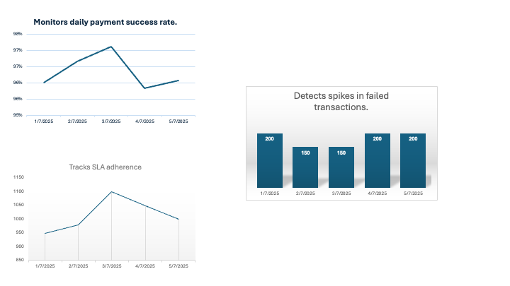

# 👋 Hi, I'm Suthaton Nitikultanon

🚀 **Product Operations and Payment Operations Specialist**

- 7+ years in fintech, payment solutions, and logistics
- Strong in process improvement, troubleshooting, and cross-team collaboration
- Experienced with payment flows, incident management, SLA monitoring

🛠 **Skills:**

- Technical Support & Troubleshooting
- Process Improvement & SOP Writing
- SQL Queries and Data Analysis
- Jira, HelpScout
- Product Operations and Client Engagement

📬 **Reach me:**

- Email: [suthaton@gmail.com](mailto:suthaton@gmail.com)
- LinkedIn: [https://www.linkedin.com/in/suthaton-nitikultanon/](https://www.linkedin.com/in/suthaton-nitikultanon/)

---

## 📄 SOP Documents

- [Incident Management SOP](./incident-management-sop.md)

---

## 🗄️ SQL Sample Queries

Explore example SQL queries useful for payment operations, including:

- Monitoring failed transactions
- SLA compliance analysis
- Error trends analysis

[View SQL Sample Queries](./sql-sample-queries.md)

---

## 📊 Dashboard Example

I created this Excel dashboard to monitor payment operations KPIs and SLA performance.

- Daily payment success rate
- Failed transactions trends
- Average processing times for SLA monitoring

[Download Excel Dashboard](./Dashboard.xlsx)

---

## Showcase

- [Incident Report Sample](./showcase/incident_report_sample.md)
- [SQL Query Samples](./showcase/sample_sql_queries.sql)
- [Knowledge Base Article](./showcase/knowledge_base_sample.md)
- [Mock Jira Ticket](./showcase/mock_jira_ticket.md)
- [UAT Test Cases](./showcase/uat_test_cases.md)

## 🎯 About This Profile

This GitHub profile showcases my skills and experience relevant for roles in payment operations, product operations, and technical support in fintech and digital payments industries. Feel free to explore my repositories and documents.

---
